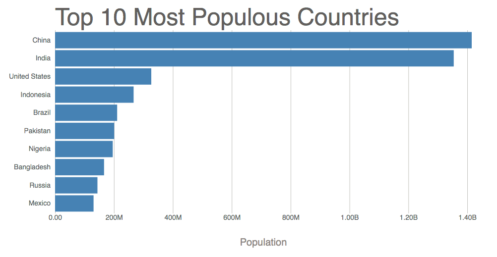

## Making a bar chart with d3.js and svg

### Data
- This bar chart shows population of the top 10 most populous countries. The data comes from the year 2018 estimate in [United Nations: World Population Prospects 2017](https://esa.un.org/unpd/wpp/Download/Standard/Population/). It also demonstrates customization of D3 axes.

### vizhub
- See also the first bar chart visualization that this one builds on: [Making a Bar Chart](https://vizhub.com/curran/dd44f8fcdc8346ff90bddd63572bf638).

### process
- add data and confirm it is loaded to console
    - csv file with 2 columns and 10 rows
    ```js
    csv('data.csv').then(data => {
        console.log(data);
    })
    ```
- create rectangles fro each row inside of render function
    ```js
    g.selectAll('rect').data(data)
        .enter().append('rect')
    ```
- use linear and band scales
    - import `scaleLinear`, `scaleBand`
    - define xScale and yScale with `.domain()`, .`.range()`
    - `.padding(0.1)` for yScale will give gap between each row
- add axes with margin convention
    - define innerWidth and innerheight
- format axis
    - [d3-format github](https://github.com/d3/d3-format)
    - [formatting numbers example](http://bl.ocks.org/zanarmstrong/05c1e95bf7aa16c4768e)
    - custom formatting function
    ```js
    const xAxisTickFormat = number => {
        format('.3s')(number)
            .replace('G', 'B')
    }
    ```
- add axis label

- add tick line

- apply different color
    - reference for color and formatting [Sunlight-StyleGuide-Datavis](https://github.com/amycesal/dataviz-style-guide/blob/master/Sunlight-StyleGuide-DataViz.pdf)

### bar-chart
- before customizing axes (just adding a title)

- after customizing axes and styling
