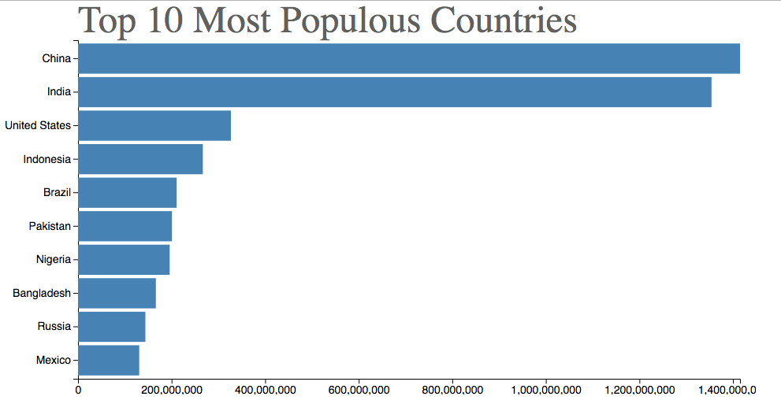

## Making a bar chart with d3.js and svg

### Data
- This bar chart shows population of the top 10 most populous countries. The data comes from the year 2018 estimate in [United Nations: World Population Prospects 2017](https://esa.un.org/unpd/wpp/Download/Standard/Population/). It also demonstrates customization of D3 axes.

### vizhub
- See also the first bar chart visualization that this one builds on: [Making a Bar Chart](https://vizhub.com/curran/dd44f8fcdc8346ff90bddd63572bf638).

### bar-chart
- before customizing axes (just adding a title)
