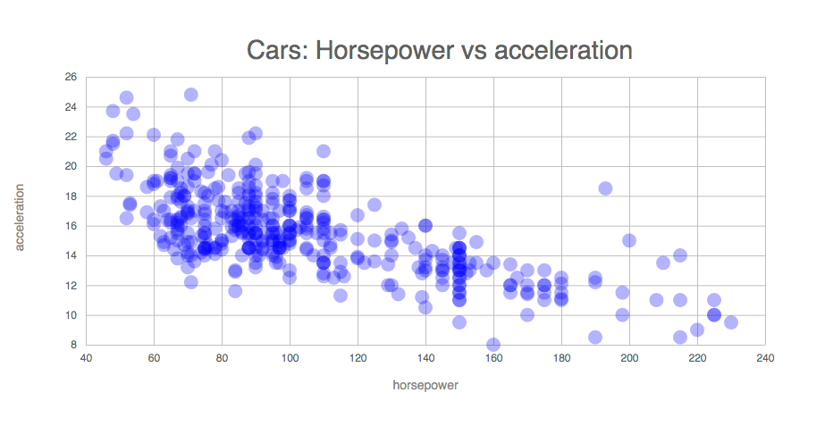
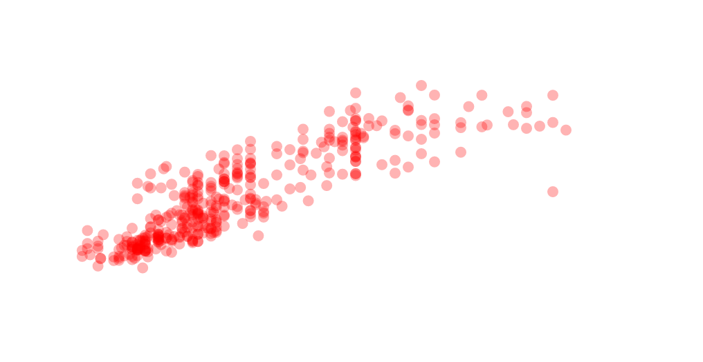
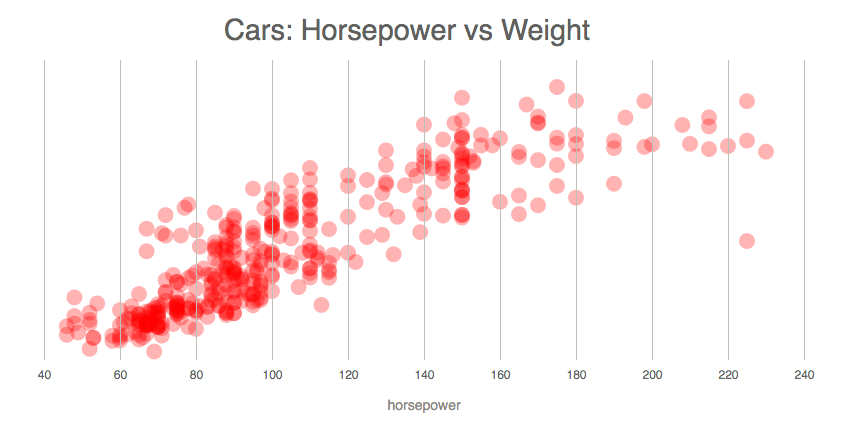
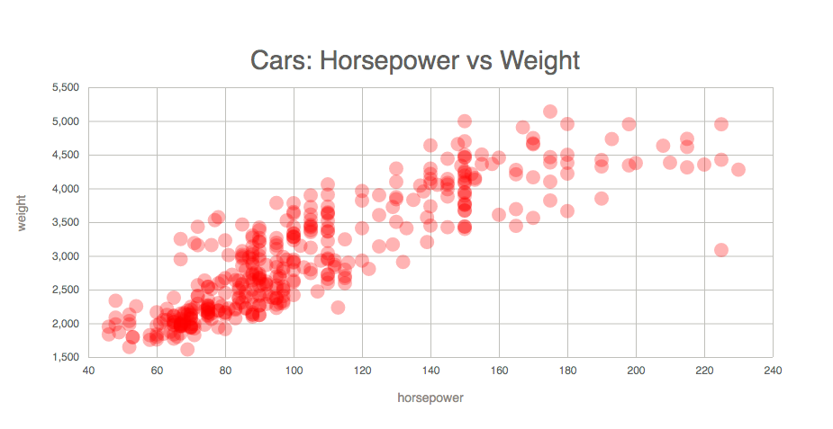

## Making scatter plot with d3.js

### Data
- [Using this data format](https://vizhub.com/curran/datasets/auto-mpg.csv), data from [UCI Machine Learning Repository: Auto MPG Data Set](http://mlr.cs.umass.edu/ml/datasets/Auto+MPG)
```js
// when you fetch data
// columns: (9) ["mpg", "cylinders", "displacement", "horsepower", "weight", "acceleration", "year", "origin", "name"]
// length: 392
{
  acceleration: "12"
  cylinders: "8"
  displacement: "307"
  horsepower: "130"
  mpg: "18"
  name: "chevrolet chevelle malibu"
  origin: "USA"
  weight: "3504"
  year: "1970"
}
```

### Add title and axes
- Make constants for title and x/y axis label, when you change the constant, data vis will change
  - will implement selection tool with React.js 
  

### Add states for interative scatter plot
- Add states for data, xcolumn, and ycolumn
- For columns, add `onXcolumnClicked`, `onYcolumnClicked` so it will change states when users clicked different column name from the selection tool

### Add animation
- `d3.transition()` : a selection-like interface for animating changes to the DOM - [d3-transition](https://github.com/d3/d3-transition).
  - transitions smoothly interpolated the DOM from its current state to the desired target state over a given duration.
  - selection elements -> call selection.transition -> make the desired changes
  ```js
  d3.select("body")
  .transition()
    .style("background-color", "red");
  ```
- `transition.duration([value])` : set the transition duration to the specified value in *milliseconds*
```js
const circles = g.merge(gEnter)
  .selectAll('circle').data(data);
circles
  .enter().append('circle')
    .attr('cx', innerWidth / 2)
    .attr('cy', innerHeight / 2)
    .attr('r', 0)
  .merge(circles)
  .transition().duration(2000)
  .delay((d, i) => i * 10)
    .attr('cy', d => yScale(yValue(d)))
    .attr('cx', d => xScale(xValue(d)))
    .attr('r', circleRadius);
```

### End result
- Getting data with `d3.csv` and creating dots with style

- Added x-axis with grouping domain-removed-axis and x axis label

- Added y-axis


- Added dropdown menus for axes with animated display
