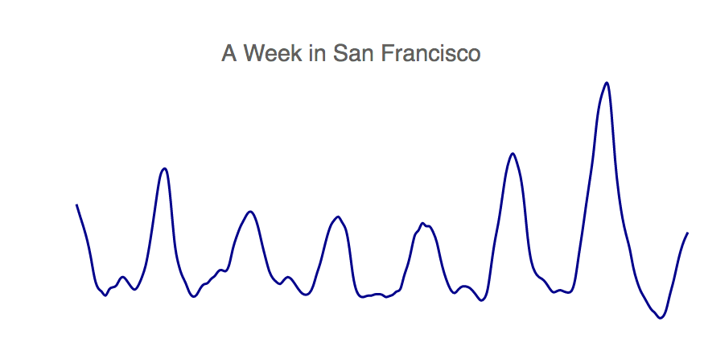
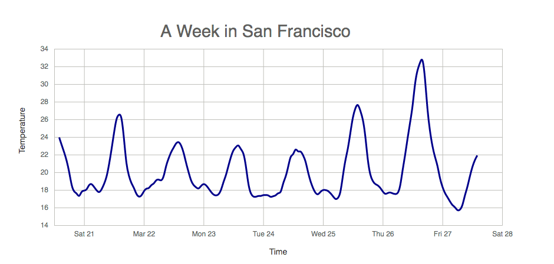

## Make a line chart
### Data
- Fetch SF temperature data
```js
// columns: (2) ["timestamp", "temperature"] <== celcius (C)
// length: 169
{
  temperature: "23.9516625615764"
  timestamp: "2015-03-20T21:00:00.000Z"
}
```

### Display line
- Define a function `lineGenerator` and append it to group
```js
const lineGenerator = d3.line()
  .x(d => xScale(xValue(d)))
  .y(d => yScale(yValue(d)))
  .curve(d3.curveBasis);

g.append('path')
  .attr('class', 'line-path')
  .attr('d', lineGenerator(data));
```

### Add axis

### Stretch goal
- I can add area with two colors (AM and PM) showing difference between AM and PM temperature in SF.

### End result
- Just added data and line generate function


- Added axes and .domain from axis has same color as ticks
