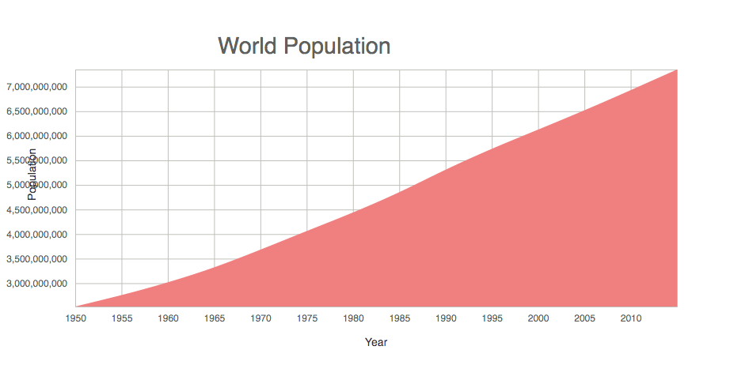
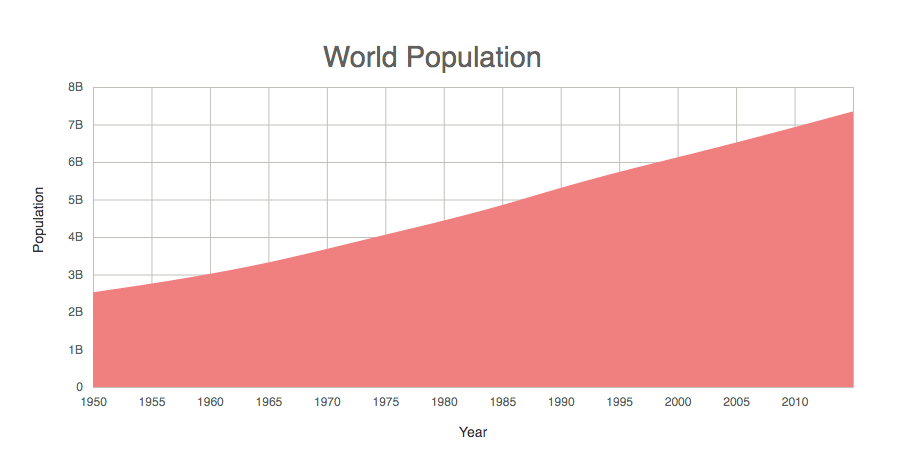

## Make a line chart
### Data
- Fetch SF temperature data
```js
// columns: (2) ["year", "population"] <== celcius (C)
// length: 66
{
  population: "2525149312",
  year: "1950"
}
```

### Display Area
- Define a function `areaGenerator` and append it to group
```js
const areaGenerator = d3.area()
  .x(d => xScale(xValue(d)))
  .y0(innerHeight)
  .y1(d => yScale(yValue(d)))
  .curve(d3.curveBasis);

g.append('path')
  .attr('class', 'line-path')
  .attr('d', areaGenerator(data));
```

### Format y-axis
- Create tickformat function with `d3.format()`
  - reference [formatting numbers example](http://bl.ocks.org/zanarmstrong/05c1e95bf7aa16c4768e)
```js
const yAxisTickFormat = number =>
  d3.format('.1s')(number)
    .replace('G', 'B');

const yAxis = d3.axisLeft(yScale)
  .tickSize(-innerWidth)
  .tickPadding(10)
  .tickFormat(yAxisTickFormat);
```

### End result
- Just added data and area generate function

- Fixed y-axis format and adjusted scale for x, y axis for better vis

