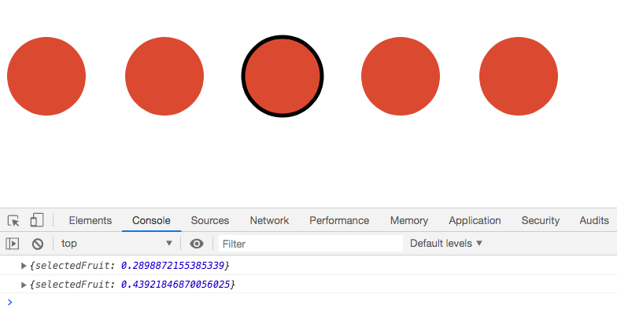

## Interaction with unidirectional data flow

### Create React app
- Added dependencies
```bash
npm install d3
```
- Edited `package.json`
  - might need to setup webpack [Setting up d3 with Babel and webpack](https://dev.to/willamesoares/setting-up-d3js-with-babel-and-webpack-dc3)
```js
{
  ...,
  "main": "src/index.js",
  ...
}
```
- Imported d3
```js
import * as d3 'd3';
```
- Created states
  - `useState`
  - can select a fruit (circle) and selected fruit will have a stroke 
  - pass props to child component
- In the child component
  - using `.map()`, created circle element will have conditional styling for `stroke` and `onClick` function which will change our state

### End result
- Screenshot of the svg and console

