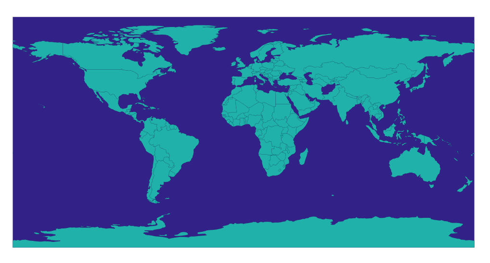
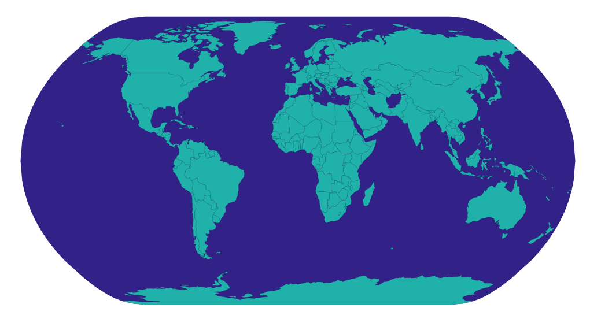

## Make a world map
### Fetch json geometries data
- Use `d3.json()` to fetch data
```js
// 177 countries data
console.log(data.objects.countries);
{
  geometries:
    {
      arcs: [0, 1, 2, 3, 4, 5],
      id: :004,
      type: "Polygon"
    },
    ...
}
```

### *topojson*
- Call `topojson.feature(topology, object)` [more info from documentation](https://github.com/topojson/topojson-client/blob/master/README.md#feature)

  - input the 2 countries data sets into the function and create a topojson object, which has a method called `.features `
  ```js
  topojsonObject = topojson.feature(country, country.objects.countries);
  topojsonDataSet = topojsonObject.features;
  // topojson generates a mathematical description of the map we want to draw
  svg.select('whateverYouKnowThisPart')
    .data(topojsonDataSet) 
    .enter()                      
    .append('path') 
    .attr("d", d3.geoPath()); 
  ```
- [TopoJSON](https://github.com/topojson/topojson)
  - an extension of GeoJSON that endoes topology
  - geometries in TopoJSON files are stitched together from shared lie segments called `arcs`

### Projection
- `d3.geoEquirectangular()`


- `d3.geoNaturalEarth1()`
