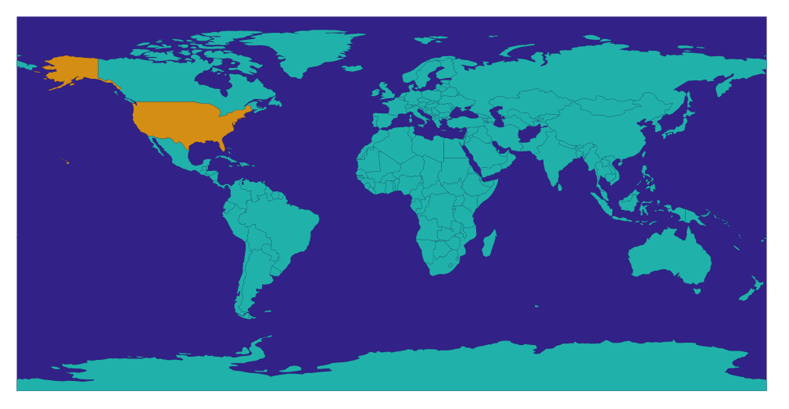
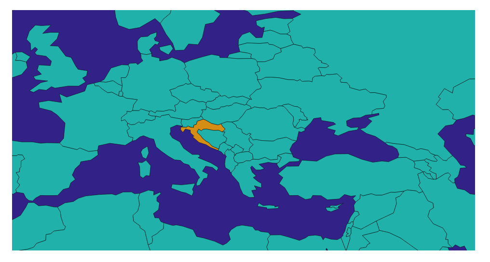

## Make a world map
### Fetch json geometries data
- Use `d3.json()` to fetch data
```js
// 177 countries data
console.log(data.objects.countries);
{
  geometries:
    {
      arcs: [0, 1, 2, 3, 4, 5],
      id: :004,
      type: "Polygon"
    },
    ...
}
```

### *topojson*
- Call `topojson.feature(topology, object)` [more info from documentation](https://github.com/topojson/topojson-client/blob/master/README.md#feature)

  - input the 2 countries data sets into the function and create a topojson object, which has a method called `.features `
  ```js
  topojsonObject = topojson.feature(country, country.objects.countries);
  topojsonDataSet = topojsonObject.features;
  // topojson generates a mathematical description of the map we want to draw
  svg.select('whateverYouKnowThisPart')
    .data(topojsonDataSet) 
    .enter()                      
    .append('path') 
    .attr("d", d3.geoPath()); 
  ```
- [TopoJSON](https://github.com/topojson/topojson)
  - an extension of GeoJSON that endoes topology
  - geometries in TopoJSON files are stitched together from shared lie segments called `arcs`

### Interative tooltip for country name
- Use `d3.tsv()` to get country name for each country id
  - out of 67 columns, country name for `name` and country id for `iso_n3`
- Use `Promise.all` to get data from different files
  - can change resolution of the map by applying different number in the url like `110m` to `50m` (better resolution)
```js
Promise.all([
  d3.tsv('https://unpkg.com/world-atlas@1.1.4/world/110m.tsv'),
  d3.json('https://unpkg.com/world-atlas@1.1.4/world/110m.json')
]).then(([tsvData, topojsonData]) => {
  const countryName = {};
  tsvData.forEach(d => {
    countryName[d.iso_n3] = d.name;
  })
  const countries = topojson.feature(topojsonData, topojsonData.objects.countries);
    g.selectAll('path').data(countries.features)
      .enter().append('path')
        .attr('class', "country")
        .attr('d', pathGenerator)
      .append('title')
        .text(d => countryName[d.id]);
})
```

### Panning & Zooming
- Now map is able to zoom in and out
```js
svg.call(d3.zoom().on('zoom', () => {
  g.attr('transform', d3.event.transform);
}));
```

### Projection
- `d3.geoEquirectangular()`


- `d3.geoNaturalEarth1()`


### End result
- Map will show the country name after you hover over it

