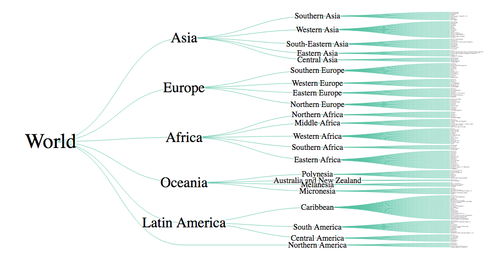
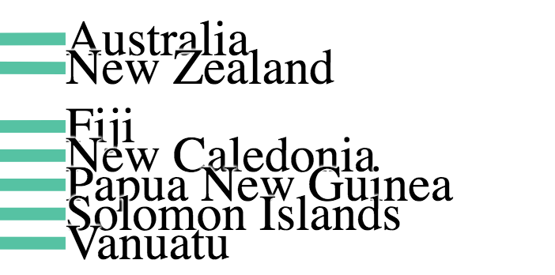

## World countries tree visualization

### d3 hierarchy
- A nested data structure representing a tree.
  - Each node has one parent node (node.parent), except for the root, and has one or more child nodes (node.children), except for the leaves.
  ```js
  family = d3.hierarchy({
  name: "root",
  children: [
      {name: "child #1"},
      {
        name: "child #2",
        children: [
          {name: "grandchild #1"},
          {name: "grandchild #2"},
          {name: "grandchild #3"}
        ]
      }
    ]
  })
  ```
- Before you can compute a hierarchical layout, you need a [root node](https://observablehq.com/@d3/d3-hierarchy).
  - If your data is already in a hierarchical format, such as JSON, you can pass it directly to `d3.hierarchy`.
  - Otherwise, you can rearrange tabular data, such as comma-separated values (CSV), into a hierarchy using `d3.stratify`.
- `d3.tree()` creates a new tree layout with default setting.
  - The tree layout produces tidy node-link diagrams of trees using the Reingold–Tilford “tidy” algorithm.


### End result


