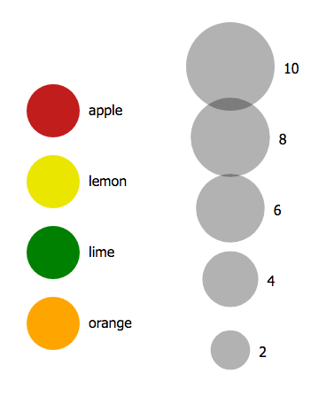

## Color legend and size legend
### Create a scale for color and legend
- `d3.scaleOrdinal()`
  - It maps discrete values (specified by an array) to discrete values (also specified by an array).
  - The domain array specifies the possible input values and the range array the output values. The range array will repeat if it’s shorter than the domain array.
  ```js
  var myData = ['Jan', 'Feb', 'Mar', 'Apr', 'May', 'Jun', 'Jul', 'Aug', 'Sep', 'Oct', 'Nov', 'Dec']

  var ordinalScale = d3.scaleOrdinal()
    .domain(myData)
    .range(['black', '#ccc', '#ccc']);

  ordinalScale('Jan');  // returns 'black';
  ordinalScale('Feb');  // returns '#ccc';
  ordinalScale('Apr');  // returns 'black';
  ```

- `d3.scaleSqrt()`
  - It is a special case of the power scale (where k = 0.5) and is useful for sizing circles by area (rather than radius). 
    - When using circle size to represent data, it’s considered better practice to set the area, rather than the radius proportionally to the data.
  ```js
  var sqrtScale = d3.scaleSqrt()
    .domain([0, 100])
    .range([0, 30]);

  sqrtScale(0);   // returns 0
  sqrtScale(50);  // returns 21.21...
  sqrtScale(100); // returns 30
  ```
- Reference: [Scale functions](https://www.d3indepth.com/scales/)

### Modular JavaScript
- Added type to `script` to use `import`
  - otherwise, getting `Uncaught SyntaxError: Cannot use import statement outside a module`
  - [ES6 Modules](https://medium.com/@mattlag/es6-modules-getting-started-gotchas-2ad154f38e2e)
```html
<script type="module" src="index.js"></script>
```


### End result
